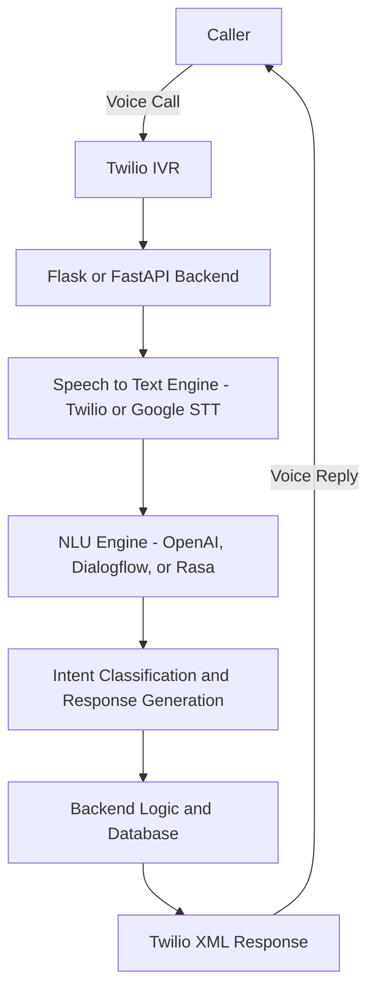

# 🤖 AI-Enabled Conversational IVR Modernization Framework 

## 📘 Overview
The **AI-Enabled Conversational IVR Modernization Framework** is designed to upgrade traditional Interactive Voice Response (IVR) systems using **Twilio or ACS**, **AI-based speech understanding**, and **cloud-based automation**.  
This project enables customers to interact with systems in a **natural, human-like conversational flow** instead of menu-based keypress inputs.

---

## 🚀 Key Features
- 🔊 **Voice Interaction** – Handles natural language through Twilio Voice API.
- 🧠 **AI-Powered Understanding** – Uses NLP/NLU to extract user intent and respond intelligently.
- ☁️ **Serverless Backend** – Deployed using AWS Lambda or Render for scalable serverless execution.
- 💬 **Dynamic Dialog Flow** – Supports context-based responses and intelligent routing.
- 📊 **Analytics Dashboard** – Tracks call logs, user intent accuracy, and call summaries.
- 🔐 **Secure Environment** – Managed using `.env` for storing sensitive credentials.

---
## 🏗️ System Architecture

## ⚙️ Tech Stack

| Component | Technology Used |
|------------|-----------------|
| **Voice Gateway** | Twilio Voice API |
| **Backend** | Python (Flask or FastAPI) |
| **AI / NLP** |  Dialogflow |
| **Database** | MySQL / PostgreSQL |
| **Hosting** |  Render  |
| **Monitoring** | Twilio Console |
| **Environment Management** | dotenv |
---
## 🪪 License

This project is licensed under the MIT License — feel free to use and modify it for your own educational or commercial projects.
