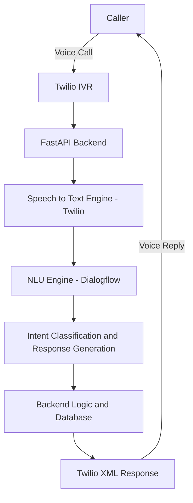

# 🤖 AI-Enabled Conversational IVR Modernization Framework 

## 📘 Overview
The **AI-Enabled Conversational IVR Modernization Framework** is designed to upgrade traditional Interactive Voice Response (IVR) systems using **Twilio or ACS**, **AI-based speech understanding**, and **cloud-based automation**.  
This project enables customers to interact with systems in a **natural, human-like conversational flow** instead of menu-based keypress inputs.

---
## 🎯 Objectives
- 🚀 Modernize legacy IVR systems to AI-driven conversational IVR.  
- 🔗 Enable seamless integration with ACS and BAP platforms.  
- 🤖 Improve call routing, user experience, and operational efficiency.  
- 📊 Capture actionable analytics from voice interactions.

---  
## 🚀 Key Features
- 🔊 **Voice Interaction** – Handles natural language through Twilio Voice API.
- 🧠 **AI-Powered Understanding** – Uses NLP/NLU to extract user intent and respond intelligently.
- ☁️ **Serverless Backend** – Deployed using AWS Lambda or Render for scalable serverless execution.
- 💬 **Dynamic Dialog Flow** – Supports context-based responses and intelligent routing.
- 📊 **Analytics Dashboard** – Tracks call logs, user intent accuracy, and call summaries.
- 🔐 **Secure Environment** – Managed using `.env` for storing sensitive credentials.

---
## 🏁 Project Milestones

### 🧩 Milestone 1 – Legacy System Analysis
- Assess current VXML-based IVR systems  
- Document architecture, integration needs, and compatibility gaps  
- Identify technical challenges and constraints  

### ⚙️ Milestone 2 – DTMF IVR Flow
- Welcome menu with multiple options:
  - 1️⃣ Train Availability  
  - 2️⃣ PNR Status  
  - 3️⃣ Customer Agent  
  - 4️⃣ Ticket Cancellation  
  - 5️⃣ Refund Status  
  - 6️⃣ Train Running Status  
  - 7️⃣ Seat Availability  
  - 8️⃣ Station Enquiry  
  - 9️⃣ Return to Main Menu
- TwiML responses for each user input  
- Redirects and graceful handling of invalid options  

### 🗣️ Milestone 3 – Speech-Based IVR
- Speech recognition input via Twilio `<Gather input="speech">`  
- NLP-powered **intent detection**  
- Supported intents:
  - 🎫 `book_ticket` – Books a ticket  
  - ❌ `cancel_ticket` – Cancels an existing ticket  
  - 💰 `check_refund` – Checks refund status  
  - 🚂 `train_status` – Checks train running status  
  - 🪑 `seat_availability` – Checks seat availability  
  - 🏢 `station_enquiry` – Handles station-related queries  
  - 🤔 `unknown_intent` – Handles unrecognized input  

### 📊 Milestone 4 – Monitoring, Testing & Deployment
- `/health` → Health check endpoint  
- `/metrics` → Returns system uptime and operational status  
- `/test/ivr` → QA testing endpoint for simulating user input and verifying detected intents  
- Deploy the integrated IVR system in production  
- Monitor post-deployment system behavior  
- Resolve performance issues and optimize conversational flows

---  
## 🏗️ System Architecture

---
 📁 ivr-project/
│
├─ Backend_ivr.py            # FastAPI backend for AI Conversational IVR 
├─ requirements.txt          # Python dependencies
├─ Procfile                  # For deployment (Render)
├─ README.md                 # Project documentation + deployment URL
├─ LICENSE.md                # License info
├─ Milestone 1.docx          # Milestone report/document
├─ agile.docx                # Agile methodology documentation
├─ Defect_Tracker.docx       # Defect tracking report
├─ Unit_Test/                # Folder for unit test scripts and results
└─ PPT/                      # Folder containing presentation files
---

---
## ⚙️ Tech Stack

| Component | Technology Used |
|------------|-----------------|
| **Voice Gateway** | Twilio Voice API |
| **Backend** | Python (Flask or FastAPI) |
| **AI / NLP** |  Dialogflow |
| **Database** | MySQL / PostgreSQL |
| **Hosting** |  Render  |
| **Monitoring** | Twilio Console |
| **Environment Management** | dotenv |

---
# AI Conversational IVR

This is a **speech-only AI-enabled IVR system** supporting English and Hindi with Indian voices.

## Deployment

The app is deployed and accessible at:

https://ai-enabled-conversational-ivr-fjpb.onrender.com

## Usage

- Open the above URL in your browser or use Twilio to connect a voice call.
- Speak in **English** or **Hindi** to interact with the IVR.
- Available commands:
  - "Where is my train" → Get train location
  - "Seat availability" → Check available seats
  - "Book ticket" → Book a ticket
  - "Cancel ticket" → Cancel a booked ticket
  - "Refund status" → Check refund status

---
## 🪪 License

This project is licensed under the MIT License — feel free to use and modify it for your own educational or commercial projects.
